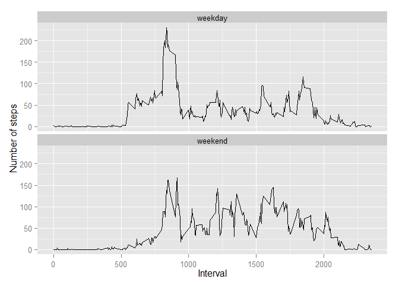

# Reproducible Research: Peer Assessment 1

## Loading and preprocessing the data
## Read in activity.csv file

#### 1. Load the data

```r
library(data.table)
library(ggplot2)

activityDS <- read.csv('activity.csv')
```
#### 2. Process/transform the data

```r
## Filter out missing obs.
activityComplete <- activityDS[complete.cases(activityDS), ]
## Filter everything except the missing obs.
activityIncomplete <- activityDS[!complete.cases(activityDS), ]

## Convert data frame to data table to make use of nice grouping stuff
activityDT <- data.table(activityComplete)

## Sum of steps by day
activitySumDaily <- activityDT[, sum(steps), by=list(date)]
## Label fields with nicer names
setnames(activitySumDaily, 'V1', 'total_steps')

## Average activity pattern
activityAvgInterval <- activityDT[, mean(steps), by=list(interval)]
## Label fields with nicer names
setnames(activityAvgInterval, 'V1', 'average_steps')

## Stop R from printing numbers using scientific notation
options(scipen=999)
```


## What is mean total number of steps taken per day?

#### 1. Make a histogram of the total number of steps taken each day

```r
## Generate histogram plot
myPlot <- with(activitySumDaily, 
               hist(total_steps,
                    breaks=10,
                    col="red", 
                    main = "Total Number of Steps", 
                    xlab="Total Number of Steps"))
```

 

#### 2. Calculate and report the mean and median total number of steps taken p/day


```r
meanWithNAs <- mean(activitySumDaily$total_steps)
medianWithNAs <- median(activitySumDaily$total_steps)
```
Mean: 10766.1887  
Median: 10765

## What is the average daily activity pattern?

#### 1. Make a time series plot of the 5-minute interval (x-axis) and... 
####    the average number of steps taken, avg across days (y-axis) 

```r
p <- ggplot(activityAvgInterval,
            aes(x=interval, y=average_steps)) + geom_line()

print(p)
```

 

#### 2. Which 5-minute interval, on average - across all days, contains max steps

```r
maxInterval <- 
    activityAvgInterval[which.max(activityAvgInterval$average_steps), ]$interval
```
Interval: 835 on average contains the max steps

## Imputing missing values
#### 1. Calculate and report the total number of missing values

```r
numberOfMissingValues <- nrow(activityDS) - nrow(activityComplete)
```
The total number of missing values is: 2304

#### 2. Devise a strategy for filling in all of the missing values in the dataset
The following strategy in the next code chunk substitutes the missing values with the corresponding interval average

#### 3. Create a new dataset that is equal to the original with missing data substituted

```r
## Merge incomplete activities with data frame containing average intervals
activityIncompleteMerge <- 
    merge(activityIncomplete, activityAvgInterval, by="interval")

## Remove steps column and rename merged column which contains the substituted vals
activityIncompleteMerge$steps <- NULL
colnames(activityIncompleteMerge)[3] <- "steps"

## Now merge back in to original dataset 
activityImputed <- 
    merge(activityIncompleteMerge, 
          activityDS, 
          by = c("date", "interval"),
          all = TRUE)

## Final steps column will be the sum of original steps (x) and substituted steps (y)
activityImputed$steps <- 
    (ifelse(is.na(activityImputed$steps.x), 
           0, 
           activityImputed$steps.x) 
+ 
    ifelse(is.na(activityImputed$steps.y), 
           0, 
           activityImputed$steps.y))

## Convert data frame to data table to make use of nice grouping stuff
activityImputedDT <- data.table(activityImputed)

## Group sum of steps by day
activityImputedDaily <- activityImputedDT[, sum(steps), by=list(date)]
## Label fields with nicer names
setnames(activityImputedDaily, 'V1', 'total_steps')
```

#### 4.1 Make a histogram of the total number of steps taken each day 


```r
## Generate histogram plot
myPlot <- with(activityImputedDaily, 
               hist(total_steps,
                    breaks=10,
                    col="red", 
                    main = "Total Number of Steps", 
                    xlab="Total Number of Steps"))
```

 

#### 4.2 Calculate and report the mean and median


```r
meanImputed <- mean(activityImputedDaily$total_steps)
medianImputed <- median(activityImputedDaily$total_steps)                   
```
Mean: 10766.1887  
Median: 10766.1887

#### 4.3 Do these values differ from the estimated from the first part?


```r
meanDiff <- meanImputed - meanWithNAs 
medianDiff <- medianImputed - medianWithNAs 
```

Difference between Original Mean (NAs excluded) vs Imputed Mean (NAs substituted):
0  
Difference between Original Median (NAs excluded) vs Imputed Median (NAs substituted):
1.1887

It's safe to say that the difference is more or less negligible.

## Are there differences in activity patterns between weekdays and weekends?

#### 1. Create a new factor variable in the dataset with 2 levels - 'weekday' and 'weekend'


```r
## Convert factor date column to real date
activityImputedDT$date <- as.Date(activityImputedDT$date, format="%Y-%m-%d")
## Add factor variable to indicate weekday or weekend based on date
activityImputedDT$DayOfWeekType <- as.factor(
    ifelse(
        weekdays(activityImputedDT$date) %in% c('Saturday', 'Sunday'), 
        'weekend', 
        'weekday')
)

## Average daily activity pattern split by Day Of Week Type
activityImputedDoWDT <- activityImputedDT[, 
                                          mean(steps), 
                                          by=list(interval, DayOfWeekType)]
## Label fields with nicer names
setnames(activityImputedDoWDT, 'V1', 'average_steps')

head(activityImputedDoWDT)
```

```
##    interval DayOfWeekType average_steps
## 1:        0       weekday       2.25115
## 2:        5       weekday       0.44528
## 3:       10       weekday       0.17317
## 4:       15       weekday       0.19790
## 5:       20       weekday       0.09895
## 6:       25       weekday       1.59036
```

#### 2. Make a panel plot containing a time series plot of the 5 minute interval (x-axis)  
####    and the avg number of steps taken across weekend and weekdays (y-axis)


```r
## Generate panel plot - split by Day Of Week Type
p <- ggplot(activityImputedDoWDT,
            aes(x=interval, y=average_steps))

p <- p +
    geom_line() +         # Use line
    facet_wrap( ~ DayOfWeekType, ncol=1) + # Add facet for Weekend & Weekday    
    labs(x = 'Interval',              # Add some labels
         y = 'Number of steps')

print(p)
```

 
